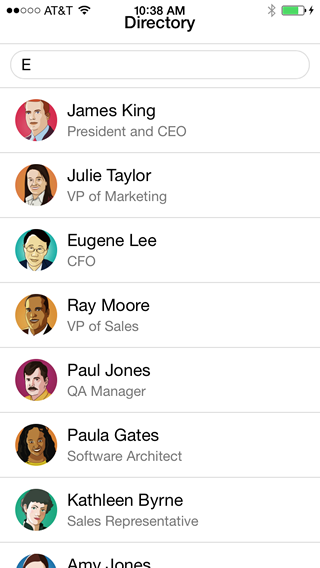
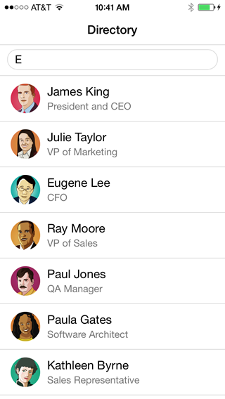

Writing HTML fragments in JavaScript and programmatically inserting them into the DOM is tedious. It makes your application harder to write and harder to maintain. HTML templates address this issue by decoupling the UI definition (HTML markup) from your code. There are a number of great HTML template solutions, including Mustache.js, Handlebars.js, and Underscore.js to name a few.

In this module, we create two templates to streamline the code of the Employee Directory application. We use 
[Handlebars.js](http://handlebarsjs.com/) but the same result can be achieved using the other HTML template solutions.

## Step 1: Define the templates

Modify index.html as follows:

1. Add a script tag to include the handlebars.js library:

    ````
    <script src="lib/handlebars.js"></script>
    ````

1. Add ratchet.css and styles.css to the head of index.html

    > [Ratchet](http://goratchet.com/) is a simple CSS toolkit that provides styles for mobile applications.

    ````
    <link href="assets/ratchet/css/ratchet.css" rel="stylesheet">
    <link href="assets/css/styles.css" rel="stylesheet">
    ````

1. Create an HTML template to render the Home View. Add this script tag as the first child of the body tag:

    ````
    <script id="home-tpl" type="text/template">
        <header class="bar bar-nav">
            <h1 class="title">Directory</h1>
        </header>
        <div class="bar bar-standard bar-header-secondary">
            <input class='search-key' type="search"/>
        </div>
        <div class="content"></div>
    </script>
    ````

1. Create an HTML template to render the employee list. Add this script tag immediately after the previous one:

    ````
    
    <script id="employee-list-tpl" type="text/template">
        <ul class="table-view">
            {{#each this}}
            <li class="table-view-cell media">
              <a href="#employees/{{ id }}">
                  
                  <div class="media-body">
                      {{firstName}} {{lastName}}
                      <p>{{title}}</p>
                  </div>
              </a>
            </li>
            {{/each}}
        </ul>
    </script>
    
    ````

## Step 2: Use the Templates

Modify the immediate function in app.js as follows:


1. Immediately before the *service* variable declaration, declare two variables that hold the compiled version of the templates defined above:

    ````
    var homeTpl = Handlebars.compile($("#home-tpl").html());
    var employeeListTpl = Handlebars.compile($("#employee-list-tpl").html());
    ````

1. Modify renderHomeView() to use the homeTpl template instead of the inline HTML:

    ````
    function renderHomeView() {
        $('body').html(homeTpl());
        $('.search-key').on('keyup', findByName);
    }
    ````

1. Modify findByName() to use the employeeListTpl template instead of the inline HTML:

    ````
    function findByName() {
        service.findByName($('.search-key').val()).done(function (employees) {
            $('.content').html(employeeListTpl(employees));
        });
    }
    ````

1. Test the application.

    


## Step 3: Fixing the Status Bar Issue on iOS7

In iOS7, the status bar overlaps the application views. As a result, the status bar text may collide with the 
application's header text as shown in the screenshot above. You can fix this issue using the statusbar plugin. 

1. Add the status bar plugin:

    ```
    cordova plugins add org.apache.cordova.statusbar
    ```

2. In app.js, add the following code at the top of the deviceready handler:

    ```
    StatusBar.overlaysWebView( false );
    StatusBar.backgroundColorByHexString('#ffffff');
    StatusBar.styleDefault();
    ```

3. Build the application again and test your application in the iOS emulator or on an iOS device.

    


<div class="row" style="margin-top:40px;">
<div class="col-sm-12">
<a href="single-page-app.html" class="btn btn-default"><i class="glyphicon glyphicon-chevron-left"></i> 
Previous</a>
<a href="creating-view-classes.html" class="btn btn-default pull-right">Next <i class="glyphicon 
glyphicon-chevron-right"></i></a>
</div>
</div>


