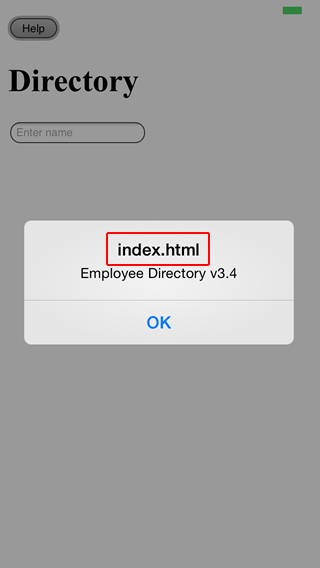
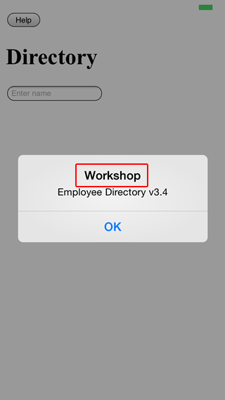

A default JavaScript alert gives away the fact that your application is not native. In this section, we set up the basic infrastructure to display native alerts when the application is running on a device, and fall back to default JavaScript alerts when it is running in the browser.



##Steps

1. Make sure you are in the **workshop** directory and add the native dialogs plugin to your project:
  
  ```
  cordova plugin add org.apache.cordova.dialogs
  ```

2. In index.html, add the following script tag (as the first script tag at the bottom of the body):

  ```
  <script src="cordova.js"></script>
  ```

  >This instructs the Cordova CLI to inject a platform specific version of cordova.js at build time. In other words, cordova.js doesn't need to be (and shouldn't be) present in your project/www folder.

3. When running on a device with the navigator.notification object available (the dialogs plugin is installed), override the window.alert() function and replace its default implementation with a call to navigator.notification.alert(). 

    Open **js/app.js**, and add this code to the "Event Registration" block:

  ```
  document.addEventListener('deviceready', function () {
      if (navigator.notification) { // Override default HTML alert with native dialog
          window.alert = function (message) {
              navigator.notification.alert(
                  message,    // message
                  null,       // callback
                  "Workshop", // title
                  'OK'        // buttonName
              );
          };
      }
  }, false);
  ```

4. Test the application: click the Help button.
    - When you run the application in the browser, you should see a standard browser alert.
    - When you run the application on your device, you should see a native alert.




<div class="row" style="margin-top:40px;">
<div class="col-sm-12">
<a href="build-cordova-project.html" class="btn btn-default"><i class="glyphicon glyphicon-chevron-left"></i> 
Previous</a>
<a href="avoid-300ms-delay.html" class="btn btn-default pull-right">Next <i class="glyphicon 
glyphicon-chevron-right"></i></a>
</div>
</div>


