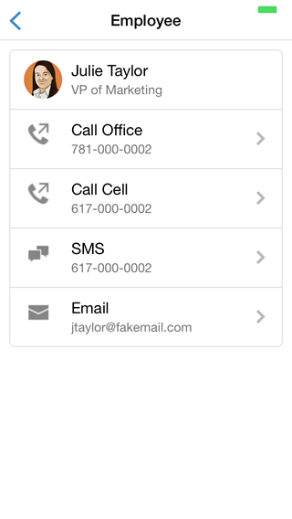

In this section, we add an employee details view. Since the application now has more than one view, we also add a simple view routing mechanism.

## Step 1: Create the employee template

Open index.html and add a template to render a detailed employee view:

  ```
  
  <script id="employee-tpl" type="text/template">
      <header class="bar bar-nav">
          <a class="btn btn-link btn-nav pull-left" href="#">
              <span class="icon icon-left-nav"></span>
          </a>
          <h1 class="title">Employee</h1>
      </header>
      <div class="content">
          <div class="card">
              <ul class="table-view">
                  <li class="table-view-cell media">
                      
                      <div class="media-body">
                          {{ firstName }} {{ lastName }}
                          <p>{{ title }}</p>
                      </div>
                  </li>
                  <li class="table-view-cell media">
                      <a href="tel:{{ officePhone }}" class="push-right">
                          <span class="media-object pull-left icon icon-call"></span>
                          <div class="media-body">
                              Call Office
                              <p>{{ officePhone }}</p>
                          </div>
                      </a>
                  </li>
                  <li class="table-view-cell media">
                      <a href="tel:{{ cellPhone }}" class="push-right">
                          <span class="media-object pull-left icon icon-call"></span>
                          <div class="media-body">
                              Call Cell
                              <p>{{ cellPhone }}</p>
                          </div>
                      </a>
                  </li>
                  <li class="table-view-cell media">
                      <a href="sms:{{ cellPhone }}" class="push-right">
                          <span class="media-object pull-left icon icon-sms"></span>
                          <div class="media-body">
                              SMS
                              <p>{{ cellPhone }}</p>
                          </div>
                      </a>
                  </li>
                  <li class="table-view-cell media">
                      <a href="mailto:{{ email }}" class="push-right">
                          <span class="media-object pull-left icon icon-mail"></span>
                          <div class="media-body">
                              Email
                              <p>{{ email }}</p>
                          </div>
                      </a>
                  </li>

              </ul>
          </div>
      </div>
  </script>
 
  ```

## Step 2: Create the EmployeeView class

1. Create a file named EmployeeView.js in the js directory, and define it as follows:

  ```
  var EmployeeView = function(employee) {

      this.initialize = function() {
          this.$el = $('<div/>');
      };

      this.render = function() {
          this.$el.html(this.template(employee));
          return this;
      };

      this.initialize();

  }
  ```

2. In index.html, add a script tag to include EmployeeView.js (just **before** the script tag for app.js):

  ```
  <script src="js/EmployeeView.js"></script>
  ```


## Step 3: Implement View Routing

1. In index.html, add a script tag to include router.js (just **after** the script tag for jquery.js):

  ```
  <script src="lib/router.js"></script>
  ```

1. Open app.js. Add the compiled employee template to the prototype of EmployeeView:

  ```
  EmployeeView.prototype.template = Handlebars.compile($("#employee-tpl").html());
  ```

1. Define the two routes used in the application:

  ```
  service.initialize().done(function () {
      router.addRoute('', function() {
          $('body').html(new HomeView(service).render().$el);
      });

      router.addRoute('employees/:id', function(id) {
          service.findById(parseInt(id)).done(function(employee) {
              $('body').html(new EmployeeView(employee).render().$el);
          });
      });

      router.start();
  });
  ```

1. Test the application.

    

    


<div class="row" style="margin-top:40px;">
<div class="col-sm-12">
<a href="creating-view-classes.html" class="btn btn-default"><i class="glyphicon glyphicon-chevron-left"></i> 
Previous</a>
<a href="hardware-acceleration.html" class="btn btn-default pull-right">Next <i class="glyphicon 
glyphicon-chevron-right"></i></a>
</div>
</div>


